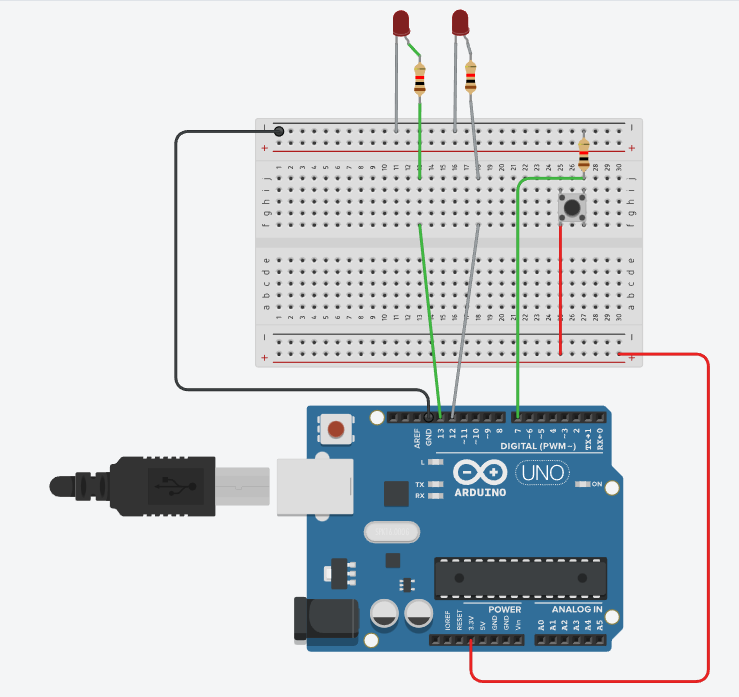
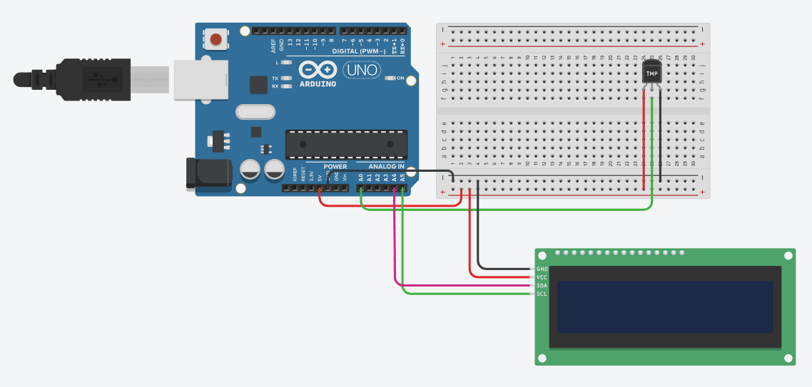
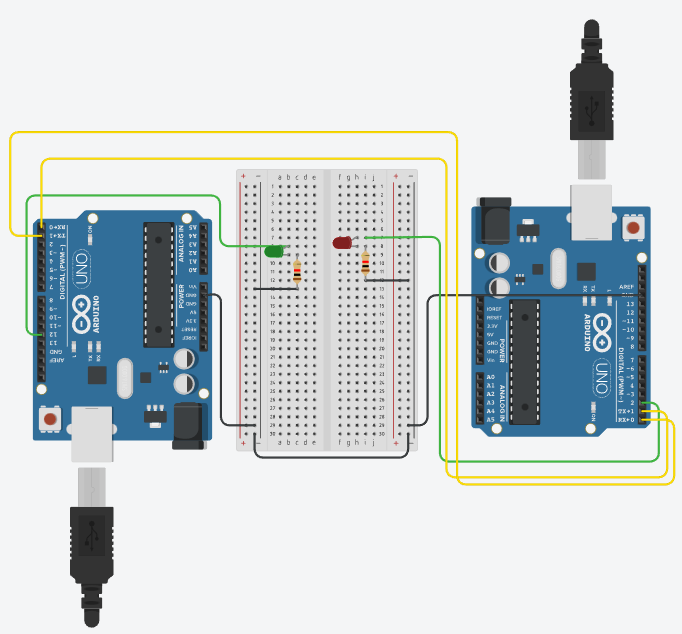

# Overview

SMS stands for Smart Metering Systems.

This subject included application of Arduino, LabView etc. in smart metering systems. 

Here are some circuits we've developed during classes.

### led
Simple circuit with Arduino & 2 LEDs.

### temperature
Arduino, temperature sensor LM35 & I2C LCD to display the result.

### uart
UART example implementation using 2 Arduinos and 2 LEDs.

